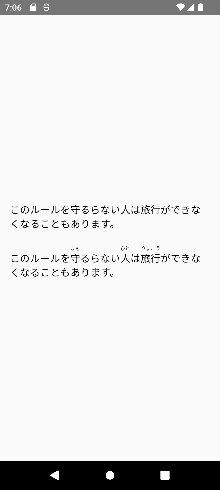

# Android Compose Furigana

> A compose library for displaying reading annotations for strings.

# Installation

First, make sure that https://jitpack.io has been declared as a Maven repository. Then just declare
the dependency either in Gradle

```groovy
dependencies {
    implementation 'com.github.mainrs:android-compose-furigana:1.0.0'
}
```

or the new Kotlin DSL

```kotlin
dependencies {
    implementation("com.github.mainrs:android-compose-furigana:1.0.0")
}
```

# Usage

See the
example [app](./app/src/main/java/net/zerotask/libraries/android/compose/furigana/example/MainActivity.kt)
for how to use the library.



# License

This project is licensed under the [MIT license](./license).
